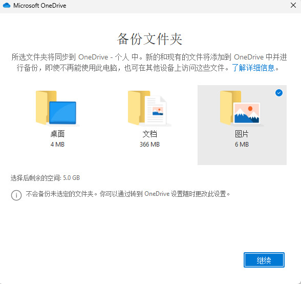
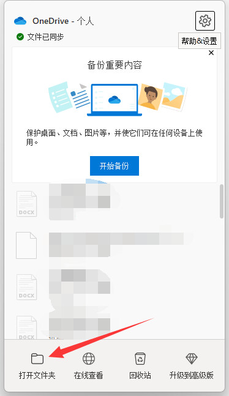
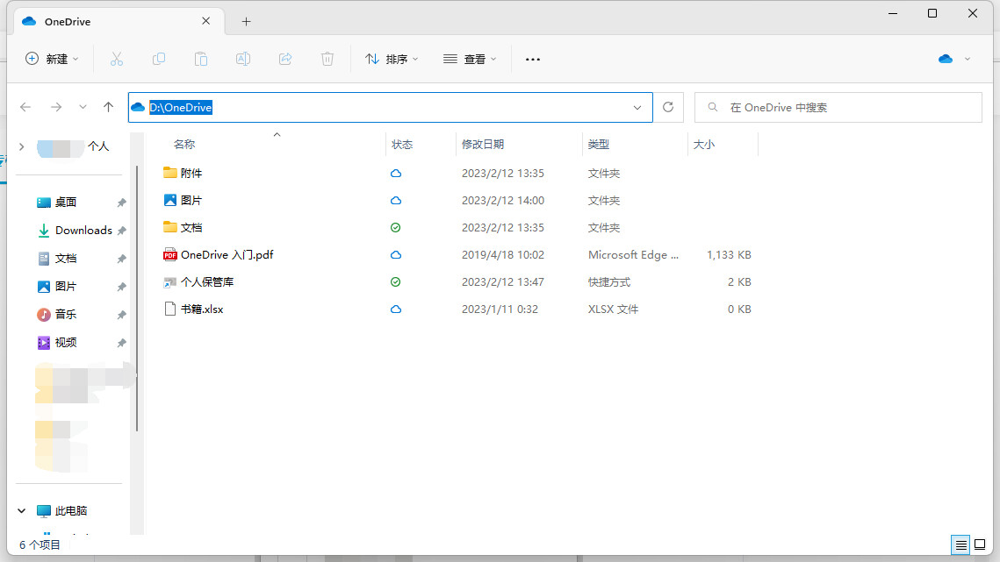
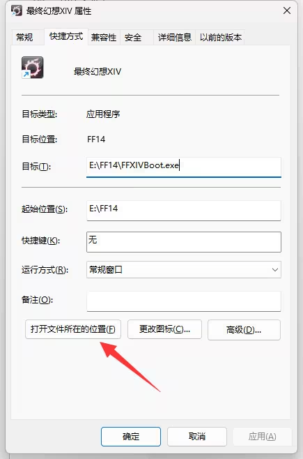
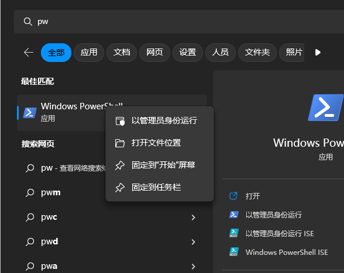
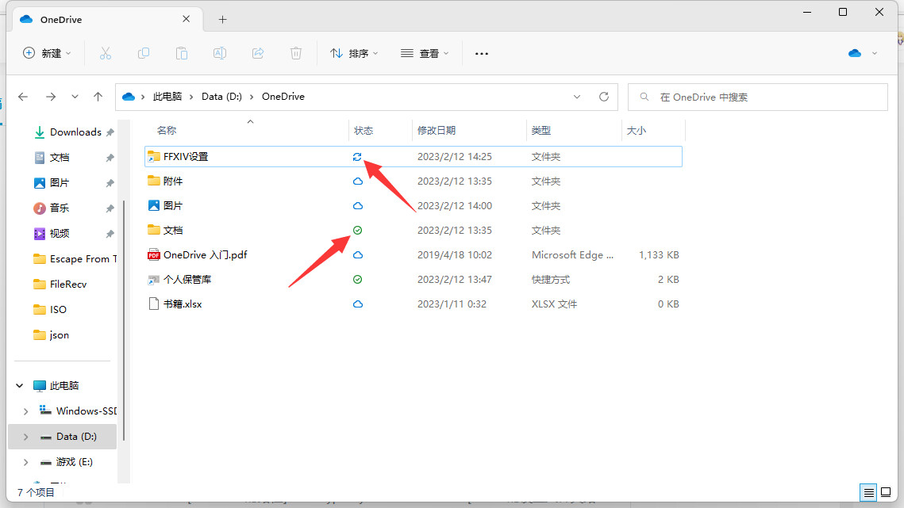

起因很简单：有人重装系统时没备份个人设置文件夹。FF14 的快捷键、热键栏、界面布局不会完整同步到官方云端，游戏内的上传也不覆盖全部项，官方同样建议自行备份。

U 盘或网盘可以拷一份，但很少会养成定期更新的习惯。硬盘坏了之后，手里那份备份可能已经隔了一年。OneDrive 会持续同步指定目录；Windows 10 / 11 自带客户端，不必另装同步软件。

目前这是我在用的做法。有更稳妥的方案欢迎补充。

## 安装 OneDrive

本机已有 OneDrive 可跳过。安装包从微软官网下载：

<https://www.microsoft.com/zh-cn/microsoft-365/onedrive/download>

安装过程连续确认即可。到「备份文件夹」这一步时，可以全都不勾选。


*文档目录里常有其他软件的存档，体积大、同步慢。只勾选图片，或不勾选任何一项，避免把无关目录卷进去。*

## 让 OneDrive 同步任意文件夹

安装完成后，客户端不能直接指定任意路径。做法是：在 OneDrive 目录里建立一个指向 FF14 设置目录的符号链接。

### OneDrive 目录

托盘打开 OneDrive，点底部「打开文件夹」。



进入后单击地址栏，复制完整路径。可用 `Win + V` 暂存在剪贴板。



本文示例：

```text
D:\OneDrive
```

### FF14 个人设置目录

右键游戏快捷方式 → 属性 → 打开文件所在的位置，得到启动器目录。



再进入 `game\My Games`。该目录包含角色数据、捏脸和系统设置。本文示例：

```text
E:\FF14\game\My Games
```

实际路径以本机安装位置为准。

### 创建符号链接

开始菜单搜索 `pw`，对 Windows PowerShell **右键 → 以管理员身份运行**。未提权时，创建符号链接通常会失败。



命令格式：

```powershell
New-Item -Path "{OneDrive 目录}" -ItemType SymbolicLink -Value "{FF14 设置目录}" -Name "{链接名称}"
```

对应上面两条路径：

```powershell
New-Item -Path "D:\OneDrive" -ItemType SymbolicLink -Value "E:\FF14\game\My Games" -Name "FFXIV设置"
```

完成后打开 OneDrive 目录，应能看到名为 `FFXIV设置` 的项。

## 如何判断已经同步

资源管理器里 OneDrive 目录有一列「状态」：

- 绿色勾：本地与云端一致
- 两个箭头：正在同步

客户端图标有时滞后，最终以网页为准：<https://onedrive.live.com/>


*箭头指向同步中（双箭头）与已完成（绿勾）。*
